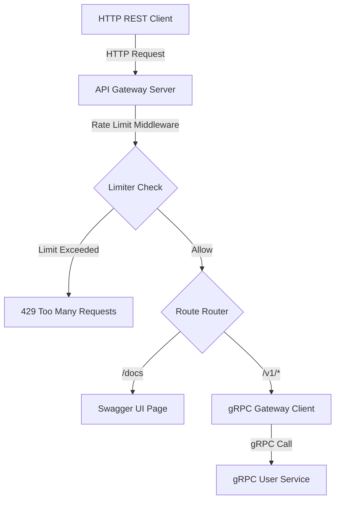

# gRPC Gateway API

API Gateway berkinerja tinggi yang dibangun menggunakan Go dan gRPC-Gateway v2 untuk menerjemahkan REST HTTP/JSON request menjadi gRPC call ke backend microservices. Proyek ini dilengkapi dengan dokumentasi Swagger UI dinamis (auto-detect) serta middleware keamanan IP Rate Limiting.

## Fitur & Kemampuan

* **Transopile REST ke gRPC**: Menerjemahkan request HTTP/JSON menjadi call gRPC secara efisien menggunakan gRPC-Gateway v2.
* **Universal Swagger UI**: Halaman dokumentasi interaktif dinamis yang mendeteksi seluruh berkas spesifikasi `.json` di direktori spesifik secara otomatis.
* **Auto-Merge Swagger**: Menggabungkan metadata dokumentasi dari berbagai service secara terpusat melalui konfigurasi `apidocs.proto`.
* **IP-Based Rate Limiting**: Middleware Token Bucket bawaan untuk membatasi laju request per IP klien secara aman.
* **Structured Logging**: Sistem logging terstruktur performa tinggi menggunakan Uber Zap.
* **Konfigurasi Lingkungan**: Manajemen konfigurasi modular berbasis environment variables dengan godotenv.

## Arsitektur & Alur Eksekusi



1. **HTTP Client** mengirimkan permintaan ke API Gateway Server.
2. Gateway melewatkan permintaan ke **Rate Limit Middleware** untuk memverifikasi kapasitas token IP pengirim.
3. Jika lolos, request dialihkan berdasarkan rute:
   * Permintaan dokumentasi (`/docs`) akan merender antarmuka **Swagger UI** dinamis yang mengambil spesifikasi dari `docs.json`.
   * Permintaan API (`/v1/*`) akan diterjemahkan ke call gRPC dan dikirimkan ke **gRPC User Service** backend.

## Struktur Folder

```text
├── cmd
│   ├── dev
│   │   └── gen_pb          # Generator protobuf & Swagger JSON
│   ├── gateway             # Entry point API Gateway server
│   └── services
│       └── user            # Entry point gRPC User Service
├── internal
│   ├── config              # Pemuat variabel lingkungan (.env)
│   ├── logger              # Logger terstruktur menggunakan Zap
│   ├── middleware          # Middleware modular (seperti rate limiter)
│   └── services
│       └── api             # Implementasi handler server gRPC
├── pb                      # Berkas hasil kompilasi protoc (*.pb.go, *.pb.gw.go)
├── proto                   # Definisi protobuf (*.proto) dan docs.json
└── third_party             # Dependensi proto eksternal (seperti Google APIs)
```

## Teknologi & Dependensi

* **Runtime**: Go 1.26+
* **Framework & Transport**: gRPC Go v1.80.0, gRPC-Gateway v2 v2.29.0
* **Logging**: Uber Zap v1.28.0
* **Configuration**: GoDotEnv v1.5.1
* **Protobuf Compiler**: protoc v3+

## Variabel Lingkungan & Konfigurasi

Buat berkas konfigurasi `.env` pada direktori root dengan spesifikasi berikut:

```env
NODE_ENV=development
GATEWAY_PORT=8080
USER_PORT=50051
```

## Kontrak API & Dokumentasi Endpoint

* **Dokumentasi Swagger UI**: `GET http://localhost:8080/docs/`
* **Spesifikasi OpenAPI JSON**: `GET http://localhost:8080/docs/docs.json`
* **User Service API**:
  * **Mendapatkan Pengguna**: `GET /v1/users/{id}`
  * **Membuat Pengguna**: `POST /v1/users` (Body: `{ "name": "string", "email": "string" }`)
  * **Menghapus Pengguna**: `DELETE /v1/users/{id}`

## Aliran Database & Migrasi

Proyek ini dirancang tanpa state (*stateless*). Seluruh manipulasi data pengguna disimulasikan menggunakan memori lokal (*in-memory mock*) pada file `internal/services/api/user.go`. Jika integrasi database ditambahkan di masa mendatang, proses migrasi skema wajib dilakukan menggunakan peralatan terstandar seperti golang-migrate.

## Panduan Instalasi & Pengembangan

### 1. Prasyarat
Pastikan program `protoc` (protobuf compiler) telah terpasang di sistem operasi Anda. Pasang pula generator Go untuk protoc:
```bash
go install google.golang.org/protobuf/cmd/protoc-gen-go@latest
go install google.golang.org/grpc/cmd/protoc-gen-go-grpc@latest
go install github.com/grpc-ecosystem/grpc-gateway/v2/protoc-gen-grpc-gateway@latest
go install github.com/grpc-ecosystem/grpc-gateway/v2/protoc-gen-openapiv2@latest
```

### 2. Unduh Dependensi Proto
Gunakan perintah berikut untuk mengunduh spesifikasi Google APIs ke direktori lokal:
```bash
mkdir -p third_party/google/api
curl -sSL https://raw.githubusercontent.com/googleapis/googleapis/master/google/api/annotations.proto -o third_party/google/api/annotations.proto
curl -sSL https://raw.githubusercontent.com/googleapis/googleapis/master/google/api/http.proto -o third_party/google/api/http.proto
```

### 3. Kompilasi Protobuf & Swagger
Jalankan skrip generator untuk mengompilasi berkas proto dan menghasilkan dokumentasi `docs.json`:
```bash
go run ./cmd/dev/gen_pb/
```

### 4. Jalankan Service Backend
Jalankan gRPC User Service backend terlebih dahulu:
```bash
go run ./cmd/services/user/
```

### 5. Jalankan API Gateway
Jalankan server HTTP Gateway pada terminal terpisah:
```bash
go run ./cmd/gateway/
```

## Proses Build & Deployment

Gunakan kompilasi bawaan Go untuk membangun biner produksi:
```bash
go build -o bin/gateway ./cmd/gateway/
go build -o bin/user-service ./cmd/services/user/
```

## Setup Kontainer / Docker

Berkas konfigurasi kontainer menggunakan pendekatan multi-stage build untuk menghasilkan biner yang sangat ringan.

### Dockerfile (Gateway)
```dockerfile
FROM golang:1.26-alpine AS builder
WORKDIR /app
COPY go.mod go.sum ./
RUN go mod download
COPY . .
RUN CGO_ENABLED=0 GOOS=linux go build -o gateway ./cmd/gateway/

FROM alpine:latest
WORKDIR /root/
COPY --from=builder /app/gateway .
COPY --from=builder /app/proto ./proto
EXPOSE 8080
CMD ["./gateway"]
```

## Strategi & Eksekusi Pengujian

### 1. Verifikasi Kompilasi
Kompilasi seluruh package untuk mendeteksi kesalahan sintaksis:
```bash
go build ./...
```

### 2. Pengujian Fungsional API
```bash
curl -X 'GET' 'http://localhost:8080/v1/users/1' -H 'accept: application/json'
```

### 3. Pengujian Keamanan Rate Limiting
Kirimkan 15 request dengan cepat untuk memicu batas token bucket (kapasitas burst 10):
```bash
for i in {1..15}; do curl -si -X 'GET' 'http://localhost:8080/v1/users/1' | head -n 1; done
```
Hasil respon ke-11 dan seterusnya harus menampilkan kode status `429 Too Many Requests`.

## Alur Kerja CI/CD

Pada infrastruktur otomatisasi (seperti GitHub Actions atau GitLab CI), alur verifikasi berikut dijalankan pada setiap push/merge request:
1. Pemasangan compiler protobuf dan dependensi Go.
2. Validasi format kode menggunakan `gofmt -l .`.
3. Menjalankan pengetesan unit test via `go test -v ./...`.
4. Memastikan kode dapat dikompilasi sempurna via `go build ./...`.

## Pertimbangan Keamanan

* **IP Rate Limiting**: Membatasi laju request per IP secara ketat untuk mencegah serangan Denial of Service (DoS) dan brute force.
* **Sanitasi Input**: Parameter rute dan data JSON dibatasi strukturnya melalui validasi skema protobuf yang ketat pada layer gRPC.
* **Fail-Fast**: Permintaan dari klien yang melebihi batas atau tidak valid langsung ditolak di layer terluar (Gateway) untuk menghemat alokasi memori server.

## Strategi Infrastruktur & Penskalaan

* **Stateless Scaling**: API Gateway dan gRPC Service dirancang tanpa state (*stateless*), sehingga dapat direplikasi secara horizontal di belakang Load Balancer (seperti Nginx atau Kubernetes Ingress).
* **Komunikasi Efisien**: Transport data antar-service menggunakan protokol biner gRPC (HTTP/2) dengan kompresi data yang tinggi dan koneksi persisten untuk mengurangi latency.

## Panduan Pemecahan Masalah

### 1. Error: Option "(google.api.http)" unknown
Pastikan file proto Anda telah mengimpor `google/api/annotations.proto` secara benar, dan skrip `gen_pb` dijalankan dengan parameter `-Ithird_party` yang merujuk pada folder berkas proto Google API tersebut.

### 2. Error: Too Many Requests
Ini menandakan bahwa IP Anda diblokir sementara oleh rate limiter. Tunggu beberapa detik agar kapasitas token bucket terisi kembali sebelum mengirim permintaan baru.

## Standar Kontribusi & Pengembangan

* **Conventional Commits**: Semua deskripsi commit git wajib mengikuti format standar (seperti `feat:`, `fix:`, `chore:`, `refactor:`).
* **Modul Terisolasi**: Tempatkan middleware baru pada direktori `internal/middleware` dan handler bisnis pada direktori `internal/services/api` untuk menjaga keteraturan Clean Architecture.
* **Self-Documenting Code**: Kode harus ditulis dengan logika yang jelas dan struktur penamaan deskriptif. Penggunaan komentar di dalam blok kode harus dihindari sesuai dengan pedoman arsitektur bersih.
